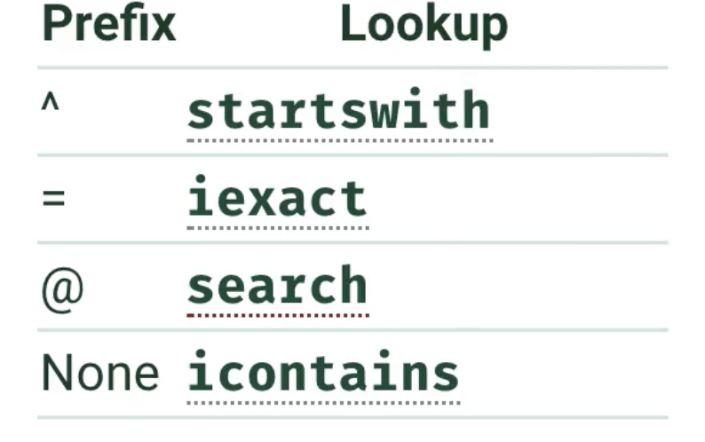
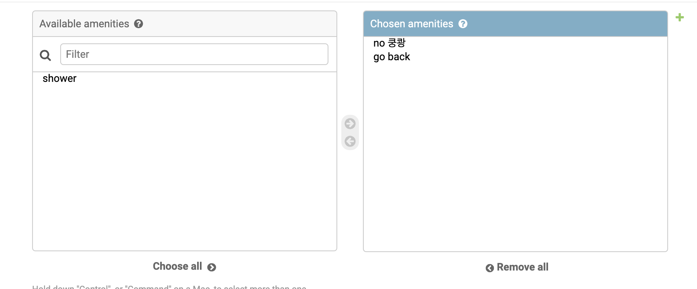

# airbnb-fullstack-clone

- visual studio code
- python3.x + django + tailwind..


### 설치

- pinenv사용.
  - 왜? `pip` 은 `install globally` 
  - 그래서 별로임.

```
pipenv --three
code .
//visual studio code에서
pipenv shell
//Launching subshell in virtual environment… 

pipenv install Django==2.2.5

```

- `pipenv shell` --> to inside in bubble.
  - 그다음에 `django` 프레임워크를 설치해야함!!(중요)


#### Django project

`python mange.py runserver`

you have 17 unapplied migration(s). Your project may not work properly until you apply the migrations for app(s): admin, auth, contenttypes, sessions.
Run 'python manage.py migrate' to apply them.

- python에서 사용할 sql이 아직 migrate가 안된상태.


`makemigration`

- 데이터의 변경을 감지하는 명령어


`migrate`

- 데이터 베이스에 감지한 변경을 업데이트하는 명령어.


`python mange.py migrate`

- `db.sqlite3` 파일이 변경됨.
- 위 명령어를 통해, `makemigrate, migrate`를 동시에 실행하는 것과 같음.


#### Django Application

- groups of function
  - 만들고자 하는 프로젝트에서 얼마나 많은 group과 function이 있는가?
  - group?  == ex) rooms
  - function == application, .ex) search rooms, book the rooms...
    - 하나의 room 에 얼마나 많은 기능이 들어가는가? 그리고 모든 기능들을 room 폴더에 넣어야할까? 그러면 너무 많은 코드를 작성하는 게 아닌가?
    - 공통된 기능들을 하나에 모아두는게 좋지 않을까? -- > `config` 에 저장하자.

- 하나의 문장으로 표현할 수 있어야한다. 뭐를? rooms이라는 그룹안에는 예약하고, 리스트하고, 수정하고, 삭제하는 기능만 들어가있을것.

- `python mange.py startapp ...` 으로 app을 생성하고, 이렇게 생성된 폴더 안에 있는 .py파일 명은 수정하면 안됨. 
  - 왜? django가 migrate할 때, 해당 이름으로 찾기 때문에. 변경하면 찾을 수 가 없겠지?
- `model.py`
  - Database
- `view.py` 
  - 보이는 쪽
- config
  - `url.py`
  - url을 관리하는  py. `users` 폴더안에 새로 만들어서, 설정을 새롭게 해줄수 있음.


### 3. User App

- Django adminstration 기본 템플릿은 주워짐.
  - 그러면 기본템플릿을 수정, 확장하려면?
    - User model을 만들고,
    - 기본 셋팅으로 바꾼다.

- python mange.py makemigrate - > migrate -> runserver


- users.models

  ```python
  from django.contrib.auth.models import AbstractUser
  from django.db import models
  
  # Create your models here.
  
  
  class User(AbstractUser):
  
      bio = models.TextField(default="")
  ```

  - default? 데이터베이스에 기본값.

  ```python
  from django.contrib.auth.models import AbstractUser
  from django.db import models
  
  # Create your models here.
  
  
  class User(AbstractUser):
  
      """ Custom User Model """
  
      avatar = models.ImageField(null=True)
      gender = models.CharField(max_length=10, null=True)
      bio = models.TextField(default="")
  
  ```

  - `null=True` null값을 허용하겠다.
  - `max_length` charField 최대값


- admin page display

  ```python
  from django.contrib import admin
  from . import models
  
  # Register your models here.
  @admin.register(models.User)
  class CustomUserAdmin(admin.ModelAdmin):
  
      list_display = ("username", "gender", "language", "currency", "superhost")
  
  ```

  

- Custom Profile 

  ```python
  from django.contrib import admin
  from django.contrib.auth.admin import UserAdmin
  from . import models
  
  # Register your models here.
  @admin.register(models.User)
  class CustomUserAdmin(UserAdmin):
  
      """ Custom User Admin """
  
      # list_display = ("username", "email", "gender", "language", "currency", "superhost")
      # list_filter = ("language", "superhost", "currency")
  
      fieldsets = UserAdmin.fieldsets + (
          (
              "Custom Profile", #  admin 셋의 파란색 패널 이름.
              {
                  "fields": (
                      "avatar",
                      "gender",
                      "bio",
                      "birthdate",
                      "language",
                      "currency",
                      "superhost",
                  )
              },
          ),
      )
  
  
  # admin.site.register(models.User, CustomUserAdmin) @admin..과 같음
  
  ```

  - UserAdmin에서 제공하는 기본 fieldset에 추가하고 싶은, Custom profile을 추가할 수 있음.
  - 위와 같은 식으로 표현하는 것으로 SQL 작성없이 웹페이지에서 보여줄 수 있음. 편리함.


### 4. Room app

- `django-admin startapp core`

  - 공통적으로 사용될 유틸? 기능들을 정리. 왜? 중복을 줄여주기 위해서. 조금이라도 편하게 작성하기 위해서

    

- `django_countries`

  - [document_countries](https://pypi.org/project/django-countries/)

  - Setting.py에서 Third Party App에 기록해둔다.

  - 기본 django에서 제공하는 app들을 추가한 후에, 내가 이용하는 package의 app을 import해야하는 순서를 기억하자

    ```python
    #good
    from django.db import models
    from django_countries.fields import CountryField
    from core import models as core_models
    
    from os #첫번째 파이썬
    from django.db import models #디장고
    from django_countries.fields import CountryField 
    from core import models as core_models #그리고 나의 package.
    
    
    
    #bad
    from django.db import models
    from core import models as core_models
    from django_countries.fields import CountryField
    ```

    

- `models.TimeField(), DateTimeField(), DateField()` 
  - 서로 다르다.
  - 어떻게 다를까???
  - DateField(auto_now_add=True), 옵션을 통해, 생성될 당시의 시간을 기록할 수있도록.
- `host = models.ForeignKey(user_models.User, *on_delete*=models.CASCADE)`
  - 외래키로 유저모델과 연결되어있네
  - 그리고 `cascade` 옵션을 통해, user 클래스가 삭제되었을 경우, host라는 변수가 삭제될 수 있도록 하고 있는듯함.

- `python manage.py createsuperuser`


---


#### makemigrate, migration 관련오류

- 오류내역
  - users app의 migration 폴더가 생성되지 않음
  - 그로인하여, migrate명령어를 통해 db에 반영되지 않음.
  - makemigrations를 해봤지만 users에 반영되지 않음을 파악.
  - setting.py의 문제일까? 봤더니 이상없음.
  - https://wayhome25.github.io/django/2017/03/20/django-ep6-migrations/ 를 통해, makemigrations 명령어 뒤에 users를 명칭함
  - 성공!


---


- forien key
  
- many to one relationship : **many room has only one user**
  
- ManyToManyField
  - many to many relationship..
  - room can have many room type

- on_delete : 는 forein key option을 줄 때만 사용됨.

- *on_delete*=models.SET_NULL
  - https://lee-seul.github.io/django/backend/2018/01/28/django-model-on-delete.html
  - 삭제되면 null값으로 바꿔준다. 그러면서 null=True을 통해, 해당 변수에 null이 들어갈 수 있도록 허용해 줘야겠지?

- Class Meta :...

  - https://docs.djangoproject.com/en/2.2/ref/models/options/

  ```python
  class RoomType(AbstractItem):
  
      """RoomType Object Definition"""
  
      pass
  
      class Meta:
          verbose_name_plural = "Room Type" #Rooms 카데고리들어가면 보여지는 목록 이름을 바꿔주고
          ordering = ["created"] #정렬을 생성된 대로함.
  
  ```

  


## 5. Other Apps

- 평점 셋팅
  - foreign key 설정을 통해 각 객체간의 연결을 해줄 수 있음. 그리고 따로 데이터베이스 설정하지 않아도 장고가 알아서 찾아서 연결해줌.

```python
    def __str__(self):
        return f"{self.review} - {self.room}"
```

- review-object가 아닌, 그 객체의 리뷰와 방의 이름이 나올것.


## 6.  Rooms admin



```python
@admin.register(models.Room)
class RoomAdmin(admin.ModelAdmin):

    """ Room Admin Definition """

    pass
    list_display = (
        "name",
        "country",
        "city",
        "price",
        "guests",
        "beds",
        "bedrooms",
        "baths",
        "check_in",
        "check_out",
        "instant_book",
    )
    list_filter = ("instant_book", "city", "country")
    search_fields = ("^city",)
    # prefix ^ 시작, = ,@ 이렇게 있음.
```

- rooms - admin.py
- iexact 대소문자 구분은 안하지만, 정확한 검색을 요구 할때,


- filter_horizontal = ("amenities", "facilities", "house_rules")

  


- ordering
- admin function


## 7. Model and QuerySets

- model -> migrate -> db
- 이제 알아볼 내용은 object가 어떻게 작동하는 가
- dir(Python), vars(Python)
  - dir -> returns class names

- QuerySet
  - list of Object from Django DB
  - very smart list
  - https://docs.djangoproject.com/en/2.2/ref/models/querysets/


- review_set....
  - Django 가 객체간 연관을 자동으로, 우리는 단지 foreign key 설정해줌으로인하여 만들어줌.
  - 즉 굉장히 간편하게 객체간에 연결해줌.

- related name
- QuerySet에 대해 : https://lqez.github.io/blog/django-queryset-basic.html


## 8. More Admins

- method inside in the model
  - model안에 def을 통해, 모든 곳에서 불러낼수 있는 function을 만들어 낼 수 있음.

```python
    def rating_average(self):
        avg = (
            self.accuracy
            + self.communication
            + self.cleanliness
            + self.location
            + self.check_in
            + self.value
        ) / 6
        return round(avg, 2)
```

- review.models에
- admin.py에서

```python
from django.contrib import admin
from . import models

# Register your models here.


@admin.register(models.Review)
class ReviewAdmin(admin.ModelAdmin):

    """Review Admin Definition"""

    list_display = ("__str__", "rating_average")

```


- timezone

  `from django.utils import timezone`

- `in_progress.boolean = True # X V 표시를 해줄수있는`

- join method .. string을 생성해줌.

- MEIAD_ROOT

- settings.py 

  ```python
  DEBUG = True
  # 개발모드라는 의미.
  # fase, 배포모드
  ```

- 라우터 생성

  ```python
  if settings.DEBUG:
      urlpatterns += static(settings.MEDIA_URL, document_root=settings.MEDIA_ROOT)
  
  #DEBUG 모드 이면, 즉 개발모드이면 url 패턴에 += static 패턴을 더하는 데 어떨때?
  #settings.MEDIA_URL 이 찾을 때, document_root= settings.MEDIA_ROOT에 가서 찾도록 바꿔주는 것.
  ```

  

- `from django.utils.html import mark_safe`

  - django에게 html을 실행시켜도 안전하다고 알려줌. 보통은 보안때문에 바로 실행가능한 javascript 코드는 실행시키지 못하도록 막아놨음.

  ```python
  def get_thumbnail(self, obj):
          return mark_safe(f'')
  
  ```

  

- raw_id fields
  
- 해당 id로 검색창을 새로 만들어주는 것
  
- inlineModelAdmin

  ```python
  class PhotoInline(admin.TabularInline):
  
      model = models.Photo
  
  @admin.register(models.Room)
  class RoomAdmin(admin.ModelAdmin):
  
      """ Room Admin Definition """
  
      inlines = (PhotoInline,)
  
  ```

  - foreign key의 중요성을 알 수 있는 코드.
  - 우리가 원하는 바를 장고가 자동으로 매칭준다. 외래키를 이용해서.

  

- save() method

- intercept

  - OOP
  - Super()

  - class inside = method, outside = function

  ```python
      def save(self, *args, **kwargs):
          print(self.city)
          super().save()
  ```

  - save_model() 이 먼저 일어나고, 그다음에 save가 일어남.
  - 즉 admin에 정의된 save가 먼저. 그다음에 model에 정의된 save


## 9. Custom Commnads and Seeding

- seed? **fake data**
- management folder
- django_seed
  - install 필요함.

- User.objects.all() 하지말자. 왜? 장고 db에 큰 부하를 줄 수 있음. 적정량만 가져올 수 있도록 코드를 짜줘야함.

```python
    def handle(self, *args, **options):
        number = options.get("number")
        seeder = Seed.seeder()
        all_users = user_models.object.all()
        room_types = room_models.RoomType.objects.all()
        seeder.add_entity(
            room_models.Room,
            number,
            {
                "name": lambda x: seeder.faker.address(),
                "host": lambda x: random.choice(all_users),
                "room_type": lambda x: random.choice(room_types),
                "guests": lambda x: random.randint(1, 20),
                "price": lambda x: random.randint(1, 300),
                "beds": lambda x: random.randint(1, 5),
                "bedrooms": lambda x: random.randint(1, 5),
                "baths": lambda x: random.randint(1, 5),
            },
        )

        seeder.execute()
        self.stdout.write(self.style.SUCCESS(f"{number} rooms created!"))

```

- lamda 식을 이용. 들어갈 데이터를 제한해줬음.
- faker() 가짜로 깔끔하게 생성할 수 있음.


- many to many field add

  ```python
          created_photos = seeder.execute()
          # list 모양정리
          created_clean = flatten(list(created_photos.values()))
  
          for pk in created_clean:
              room = room_models.Room.objects.get(pk=pk)
              # 하나의 방에 대해서 3부터 10,17 사이의 랜덤값 까지 반복한다.
              for i in range(3, random.randint(10, 17)):
                  room_models.Photo.objects.create(
                      caption=seeder.faker.sentence(),
                      room=room,
                      file=f"room_photos/{random.randint(1,31)}.webp",
                  )
  
              for a in amenities:
                  magic_number = random.randint(0, 15)
                  if magic_number % 2 == 0:
                      room.amenities.add(a)  # many to many field add
              for f in facilities:
                  magic_number = random.randint(0, 15)
                  if magic_number % 2 == 0:
                      room.facilities.add(f)  # many to many field add
              for r in rules:
                  magic_number = random.randint(0, 15)
                  if magic_number % 2 == 0:
                      room.house_rules.add(r)  # many to many field add
  
  ```

  

- managemnet folder를 통해서 faker data를 생성하는 python 파일을 만든다.

- from datetime import datetime, timedelta
  - timedelta


## 10. introduction , Views, Url

- home , login, logout url to Core
- config에거 최초 접속을 받아서, 어떤 app들로 해당 요청을 rendering 해줄지 판단하는 방법으로 만들어 나갈것.

- template

  render 을 통해, 서버에서 보내는 바를 바로 사용할 수 있음.

```python
from datetime import datetime
from django.shortcuts import render

# Create your views here.


def all_rooms(request):
    now = datetime.now()
    hungry = True
    return render(request, "all_rooms.html", context={"now": now, "hungry": hungry})

```

```html
<h1>Hello Templates</h1>

<h4>The time right now is : {{now}}</h4>

<h6>
   I'm Hungry  I'm not 
</h6>

```

- {{}} 을 이용해서
- logic을 이용하고 싶으면  를 이용함.
- python 문법과 다른점이 있기 때문에 학습이 필요하다. ,,, **{% endif % }**

- block 
  - childern content to father content